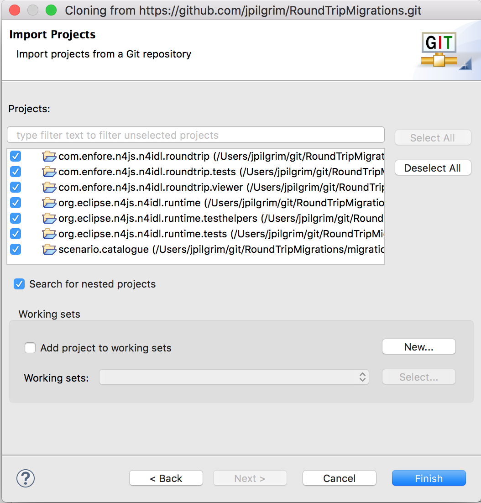
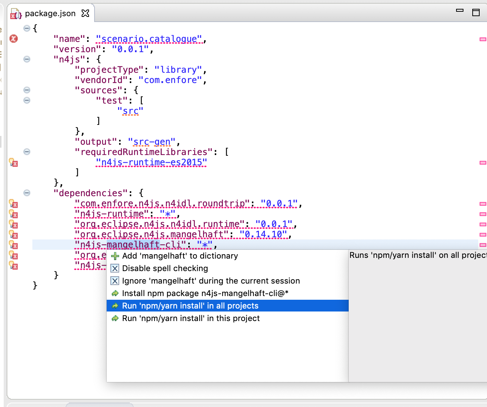
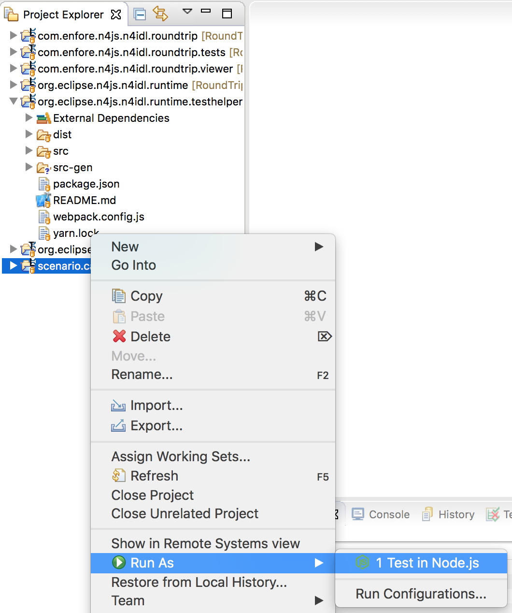
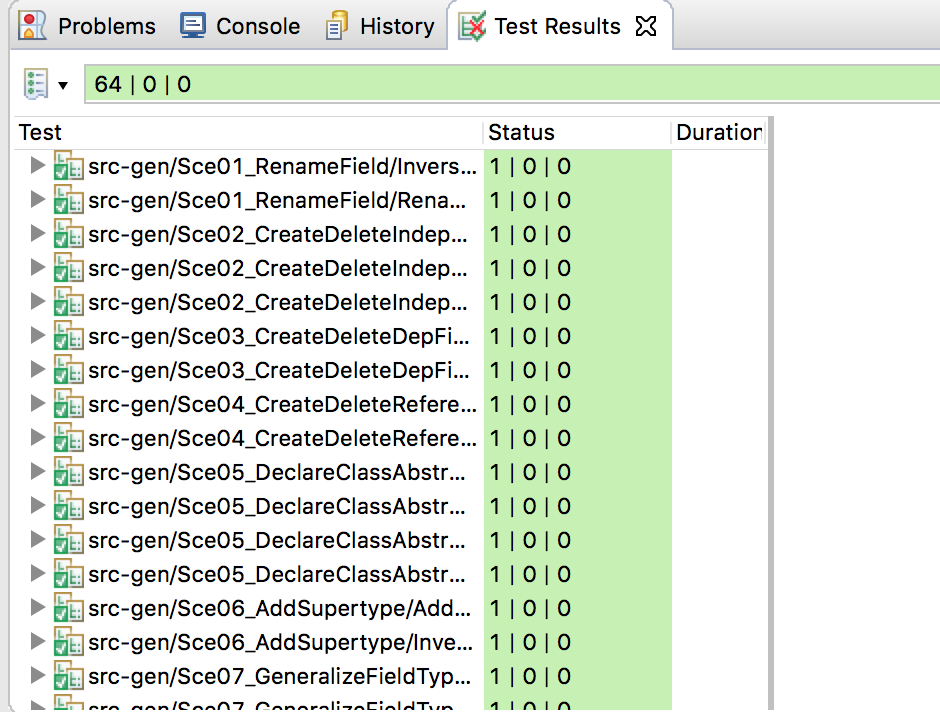

# Supplementary Material for the paper A Transformational Approach to Managing Data Model Evolution of Web Services

The catalog of round-trip migration scenarios can be found as an anonymized technical report here:

- [catalogue-report.pdf](./catalogue-report.pdf)

## Requirements

You need the following software to be installed on your machine:

- Java >=12 [Oracle Download](https://www.oracle.com/technetwork/java/javase/downloads/jdk12-downloads-5295953.html) or [OpenJDK](https://openjdk.java.net/install/)
- Node.js (https://nodejs.org, version 12 recommended)
- Yarn Package Manager (https://yarnpkg.com/lang/en/docs/install, version 1.16.0 recommended)

Furthermore you need the Eclipse N4JS IDE for executing the migrations. We tested the tooling with the following version:

- [https://archive.eclipse.org/n4js/products/nightly/0.22.5.v20200520-2342/](https://archive.eclipse.org/n4js/products/nightly/0.22.5.v20200520-2342/)

Download the IDE for your OS, extract the archive and run the IDE.

> Note: You may also use a current nightly build of the N4JS IDE, however, Eclipse N4JS is currently experiencing some issues with their IDE builds on macOS.

## Import Projects

Go to File / Import ... and select "Projects from Git" and "Clone URI".
Use this repository, i.e. use

```
https://github.com/AnonAuth/RoundTripMigrations.git
```

as the URI.

Select the master branch and select all projects on the "Import Projects" wizard page.




## Run Tests

The scenario catalogue is given as a set of N4IDL declarations and corresponding test suites, asserting the discussed migration properties.

### Install missing dependencies

After importing the projects, you will get compiler errors due to missing dependencies. 
In order to resolve all dependencies, open a package.json file with errors and choose quickfix "Run 'npm/yarn install' in all projects" (by hovering over the error message of any dependency). Alternatively you can run the tool "Install  missing dependencies" (button with two gears found in the toolbar).



### Run the Scenario Tests

In order to run all tests of the catalog, right-click the project “scenario.catalog” and select “Run As / Test in Node.js”. 



You will then see a JUnit-like view presenting test report.



# License

The content found in this project is made available under the Eclipse Public License 2.0.
